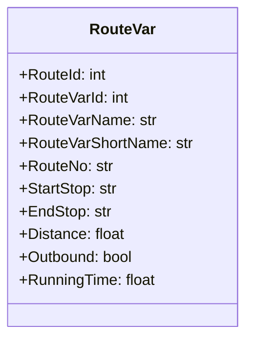
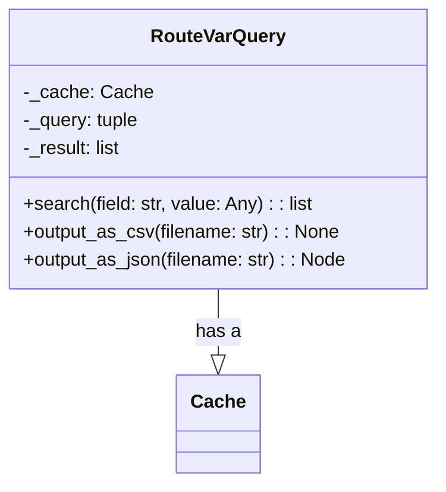
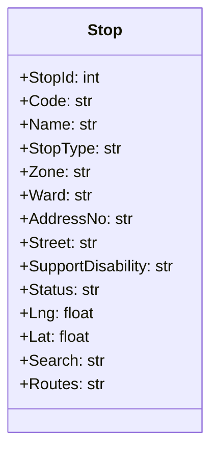
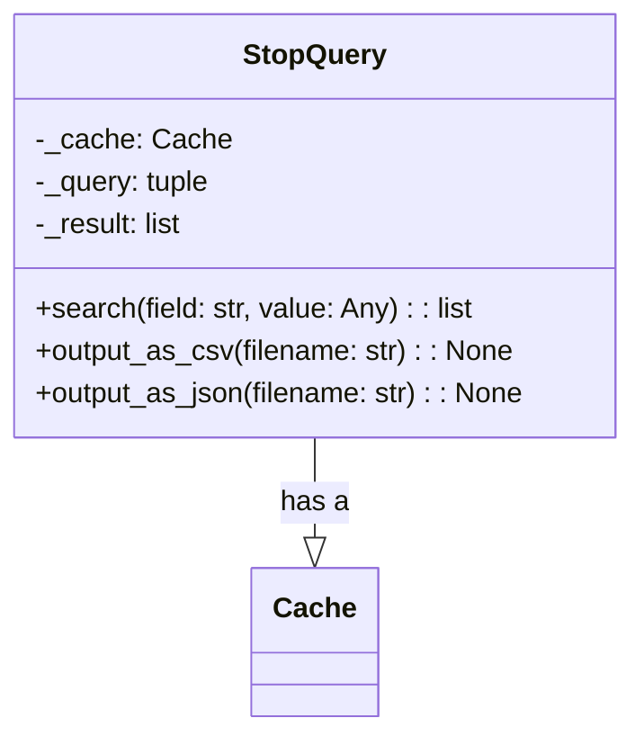
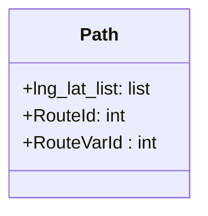
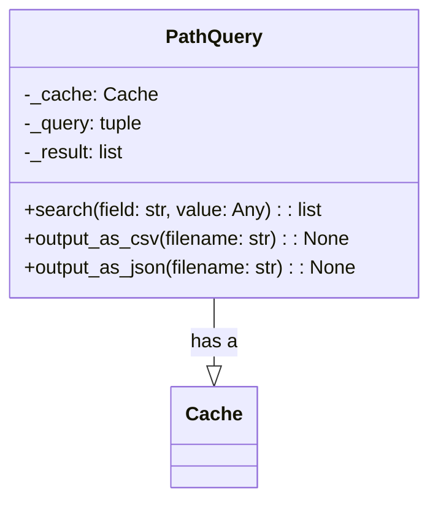

# Diagram for models

## RouteVar

```mermaid
classDiagram
    class RouteVar {
        +RouteId: int
        +RouteVarId: int
        +RouteVarName: str
        +RouteVarShortName: str
        +RouteNo: str
        +StartStop: str
        +EndStop: str
        +Distance: float
        +Outbound: bool
        +RunningTime: float
    }

```

## RouteVarQuery

```mermaid
    classDiagram
        class RouteVarQuery {
            -_cache: Cache
            -_query: tuple
            -_result: list
            +search(field: str, value: Any): list
            +output_as_csv(filename: str): None
            +output_as_json(filename: str): Node
        }
        RouteVarQuery --|> Cache: has a
```

## Stop

```mermaid
    classDiagram
        class Stop {
            +StopId: int
            +Code: str
            +Name: str
            +StopType: str
            +Zone: str
            +Ward: str
            +AddressNo: str
            +Street: str
            +SupportDisability: str
            +Status: str
            +Lng: float
            +Lat: float
            +Search: str
            +Routes: str
        }


```

## StopQuery

```mermaid
    classDiagram
        class StopQuery {
            -_cache: Cache
            -_query: tuple
            -_result: list
            +search(field: str, value: Any): list
            +output_as_csv(filename: str): None
            +output_as_json(filename: str): None
        }
        StopQuery --|> Cache: has a
```

## Path

```mermaid
    classDiagram
        class Path {
            +lng_lat_list: list
            +RouteId: int
            +RouteVarId : int
    }
```

## PathQuery

```mermaid
classDiagram
    class PathQuery {
        -_cache: Cache
        -_query: tuple
        -_result: list
        +search(field: str, value: Any): list
        +output_as_csv(filename: str): None
        +output_as_json(filename: str): None
    }
    PathQuery --|> Cache: has a
```
